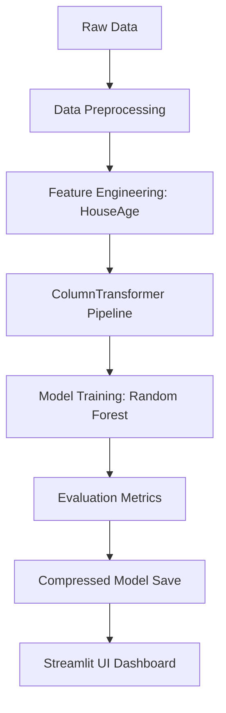

# Final Report: Intelligent Property Price Prediction

## 1. Introduction
The objective of this project is to develop a robust, classical machine learning system for predicting property prices in Melbourne, Australia. By leveraging the Melbourne Housing dataset, we aim to provide accurate valuation estimates through a structured data pipeline and optimized regression models, adhering to a "No GenAI" technical constraint for the core prediction logic.

## 2. System Architecture
The system follows a modular design consisting of a pre-processing pipeline, a training module, and a real-time Streamlit interface.

## 3. Mathematical Notation & Model Logic
Our primary model, the **Random Forest Regressor**, is an ensemble method that combines the predictions of multiple decision trees $h_k(x)$ to reduce variance and improve accuracy:

$$\hat{y} = \frac{1}{K} \sum_{k=1}^{K} h_k(x)$$

We evaluate our model using three primary metrics:

1. **Mean Absolute Error (MAE)**:
$$MAE = \frac{1}{n} \sum_{i=1}^{n} |y_i - \hat{y}_i|$$

2. **Root Mean Squared Error (RMSE)**:
$$RMSE = \sqrt{\frac{1}{n} \sum_{i=1}^{n} (y_i - \hat{y}_i)^2}$$

3. **Coefficient of Determination ($R^2$)**:
$$R^2 = 1 - \frac{\sum (y_i - \hat{y}_i)^2}{\sum (y_i - \bar{y})^2}$$

## 4. Methodology & Data Pre-processing
We implemented a `Scikit-Learn ColumnTransformer` to handle diverse feature types:
- **Numerical Features**: Median imputation for missing values followed by `StandardScaler`.
- **Categorical Features**: Most-frequent imputation followed by `OneHotEncoder`.
- **Feature Engineering**: A new feature, `HouseAge`, was derived to capture the temporal depreciation or appreciation of properties.

## 5. Results & Discussion
The Random Forest Regressor significantly outperformed the Linear Regression baseline.

| Metric | Linear Regression | Random Forest Regressor |
| :--- | :--- | :--- |
| **$R^2$ Score** | 0.6005 | **0.7710** |
| **MAE** | $274,766 | **$187,162** |
| **RMSE** | $398,362 | **$301,623** |

## 6. Conclusion
The project successfully demonstrates that classical machine learning techniques, when combined with rigorous pre-processing and feature engineering, can achieve high predictive accuracy for complex real-world datasets. The resulting Streamlit application provides a user-friendly way to democratize these insights.

## 7. References
1. *Melbourne Housing Market Dataset*, Kaggle. https://www.kaggle.com/datasets/anthonypino/melbourne-housing-market
2. Pedregosa, F. et al., *Scikit-learn: Machine Learning in Python*, JMLR 12, pp. 2825-2830, 2011.
3. Streamlit Documentation. https://docs.streamlit.io/
