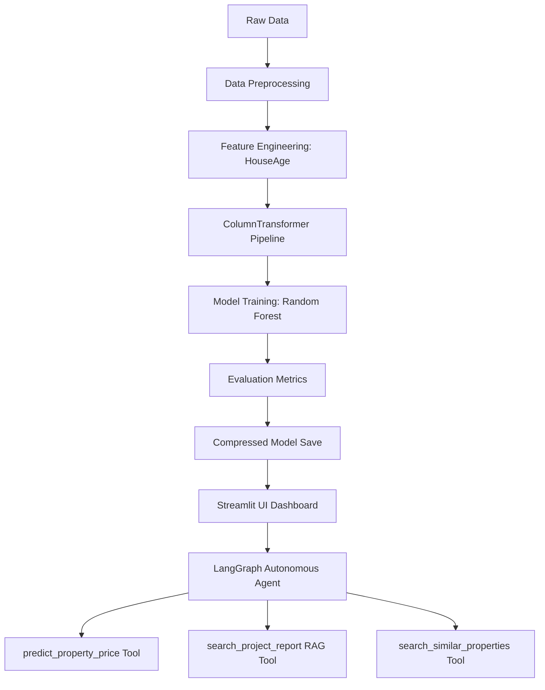

# Final Report: Intelligent Property Price Prediction

## 1. Introduction
The objective of this project is to develop a robust, classical machine learning system for predicting property prices in Melbourne, Australia. By leveraging the Melbourne Housing dataset, we aim to provide accurate valuation estimates through a structured data pipeline and optimized regression models, adhering to a "No GenAI" technical constraint for the core prediction logic.

## 2. System Architecture
The system follows a modular design with two distinct layers:

**Layer 1 — Classical ML Prediction Pipeline:**
A pre-processing pipeline ingests raw Melbourne housing data, applies feature engineering, trains regression models, and persists the best-performing model for real-time inference.

**Layer 2 — Autonomous LangGraph Agent Interface:**
The real-time Streamlit interface is powered by an Autonomous LangGraph Agent built with LangChain and LangGraph's `create_react_agent`. This agent is equipped with three specialized tools:
- `predict_property_price`: Calls the trained Scikit-Learn model to predict a property price given 10 structured features.
- `search_project_report`: A RAG (Retrieval-Augmented Generation) tool that uses FAISS vector search over this report to answer methodology questions.
- `search_similar_properties`: Queries the original Melbourne Housing dataset using Pandas to find and recommend real historical properties matching user criteria.

The agent autonomously decides which tool to invoke based on the user's natural language query, enabling a seamless conversational real estate assistant experience.

```mermaid
graph TD
    A[Raw Data] --> B[Data Preprocessing]
    B --> C[Feature Engineering: HouseAge]
    C --> D[ColumnTransformer Pipeline]
    D --> E[Model Training: Random Forest]
    E --> F[Evaluation Metrics]
    F --> G[Compressed Model Save]
    G --> H[Streamlit UI Dashboard]
    H --> I[LangGraph Autonomous Agent]
    I --> J[predict_property_price Tool]
    I --> K[search_project_report RAG Tool]
    I --> L[search_similar_properties Tool]
```

## 3. Mathematical Notation & Model Logic
Our primary model, the **Random Forest Regressor**, is an ensemble method that combines the predictions of multiple decision trees $h_k(x)$ to reduce variance and improve accuracy:

$$\hat{y} = \frac{1}{K} \sum_{k=1}^{K} h_k(x)$$

We evaluate our model using three primary metrics:

1. **Mean Absolute Error (MAE)**:
$$MAE = \frac{1}{n} \sum_{i=1}^{n} |y_i - \hat{y}_i|$$

2. **Root Mean Squared Error (RMSE)**:
$$RMSE = \sqrt{\frac{1}{n} \sum_{i=1}^{n} (y_i - \hat{y}_i)^2}$$

3. **Coefficient of Determination ($R^2$)**:
$$R^2 = 1 - \frac{\sum (y_i - \hat{y}_i)^2}{\sum (y_i - \bar{y})^2}$$

## 4. Methodology & Data Pre-processing
We implemented a `Scikit-Learn ColumnTransformer` to handle diverse feature types:
- **Numerical Features**: Median imputation for missing values followed by `StandardScaler`.
- **Categorical Features**: Most-frequent imputation followed by `OneHotEncoder`.
- **Feature Engineering**: A new feature, `HouseAge`, was derived to capture the temporal depreciation or appreciation of properties.

## 5. Results & Discussion
The Random Forest Regressor significantly outperformed the Linear Regression baseline.

| Metric | Linear Regression | Random Forest Regressor |
| :--- | :--- | :--- |
| **$R^2$ Score** | 0.6005 | **0.7710** |
| **MAE** | $274,766 | **$187,162** |
| **RMSE** | $398,362 | **$301,623** |

In summary: The Random Forest Regressor achieved an R2 score of 0.7710 and a Mean Absolute Error (MAE) of $187,162. The Linear Regression baseline achieved an R2 score of 0.6005 and a MAE of $274,766. The Random Forest model also achieved an RMSE of $301,623 compared to $398,362 for Linear Regression. These results confirm that the Random Forest Regressor significantly outperformed the Linear Regression baseline across all three evaluation metrics.

## 6. Conclusion
The project successfully demonstrates that classical machine learning techniques, when combined with rigorous pre-processing and feature engineering, can achieve high predictive accuracy for complex real-world datasets. The system is further extended with an Autonomous LangGraph Agent that powers the conversational AI interface, allowing users to predict prices, search historical properties, and query the project report — all through natural language. This dual-layer architecture (classical ML + autonomous AI agent) establishes a scalable and interpretable real estate valuation framework.

## 7. References
1. *Melbourne Housing Market Dataset*, Kaggle. https://www.kaggle.com/datasets/anthonypino/melbourne-housing-market
2. Pedregosa, F. et al., *Scikit-learn: Machine Learning in Python*, JMLR 12, pp. 2825-2830, 2011.
3. Streamlit Documentation. https://docs.streamlit.io/
