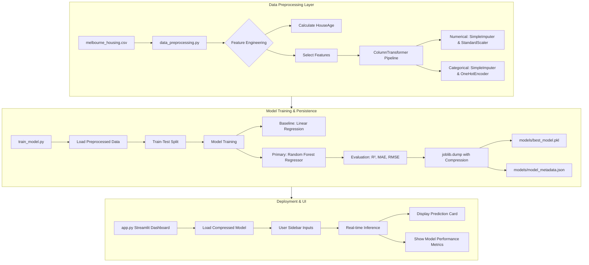

# System Workflow Diagram

```mermaid
graph TD
    subgraph Data_Pipeline [Data Preprocessing Layer]
        A[melbourne_housing.csv] --> B[data_preprocessing.py]
        B --> C{Feature Engineering}
        C --> D[Calculate HouseAge]
        C --> E[Select Features]
        E --> F[ColumnTransformer Pipeline]
        F --> G[Numerical: SimpleImputer & StandardScaler]
        F --> H[Categorical: SimpleImputer & OneHotEncoder]
    end

    subgraph Training_Layer [Model Training & Persistence]
        I[train_model.py] --> J[Load Preprocessed Data]
        J --> K[Train-Test Split]
        K --> L[Model Training]
        L --> M[Baseline: Linear Regression]
        L --> N[Primary: Random Forest Regressor]
        N --> O[Evaluation: R², MAE, RMSE]
        O --> P[joblib.dump with Compression]
        P --> Q[models/best_model.pkl]
        P --> R[models/model_metadata.json]
    end

    subgraph Interface_Layer [Deployment & UI]
        S[app.py Streamlit Dashboard] --> T[Load Compressed Model]
        T --> U[User Sidebar Inputs]
        U --> V[Real-time Inference]
        V --> W[Display Prediction Card]
        V --> X[Show Model Performance Metrics]
    end

    Data_Pipeline --> Training_Layer
    Training_Layer --> Interface_Layer
```
